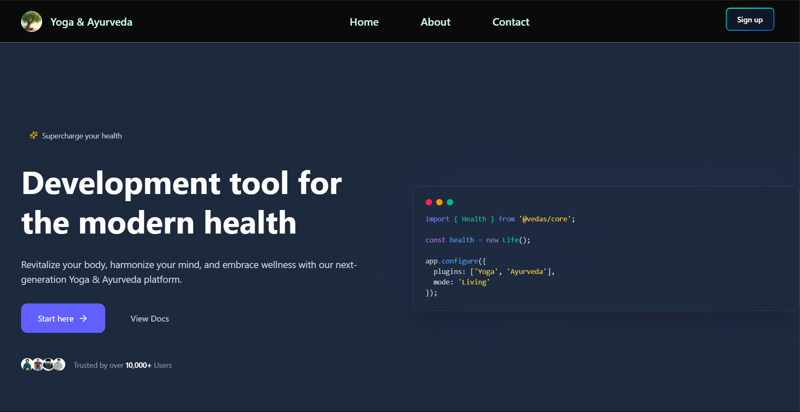
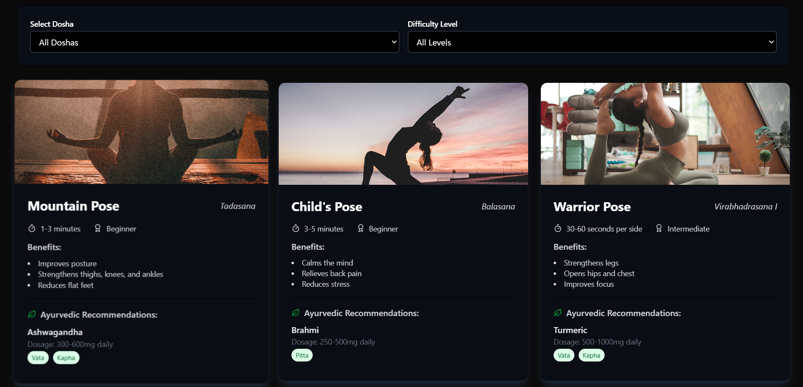

# React Yoga App




## Overview
A simple and elegant Yoga app built with React.js, featuring guided sessions, pose instructions, and a calming UI.

## Features
- Guided yoga sessions
- Pose instructions with images
- Timer for each session
- User progress tracking


## Tech Stack
- React.js
- Tailwind CSS
- Redux (for state management)
- React Router (for navigation)
- Firebase (in future)

## Installation
```bash
# Clone the repository
git clone https://github.com/shambu2/YogaApp.git
cd YogaApp/client

# Install dependencies
npm install

# Start the development server
npm start
```

## Usage
1. Select a yoga session from the homepage.
2. Follow the guided instructions and timers.


## Contributing
Feel free to submit issues and pull requests to improve the app.

## License
MIT License
